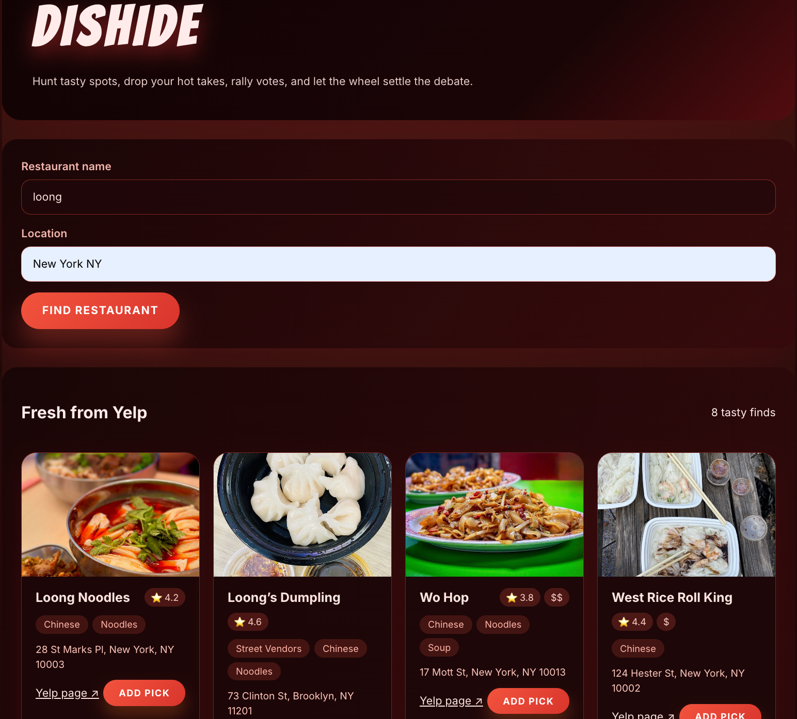

# dishide

## Problem Statement
Sometimes when I'm with my friends, we want to get food together, but the problem is that we can't decide on where to eat, even if everyone has ideas. dishide is supposed to be a tool to help people solve this conundrum.

## Solution
dishide is an app that allows users to post, see, and compare different restaurants and vote on their favorite one. If there's a tie, a spinner will randomly select an option.

## API Used
- **API Name**: Yelp Places API
- **API Documentation**: https://docs.developer.yelp.com/docs/places-intro
- **How it's used**: Users input a restaurant name and either city of the restaurant. Then, the front end calls /api/yelp, which forwards those parameters to Yelp's API to find the business. After fetching a list of possible restaurants that match the user's input, the restaurant's business details are found, including their name, address, top category labels, a primary photo, Yelp rating, and price level.

## Features
- Users can search for specific restaurants given the restaurant name and location. They can then choose the specific restaurant they had in mind (unless it's not on Yelp), add a note for why they are choosing that restaurant, and send it in for voting.
- Voting panel allows users to vote for their favorite contender, lock in their votes, and celebrate the winner with confetti. It also tells users if there is a tie, from which users can then choose to spin a wheel and have a contender be randomly chosen.
- Does not allow users to add the same restaurant twice. If first results on Yelp did not find the exact restaurant the user is looking for, the user can search further by clicking "Bring on more spots."

## Setup Instructions
1. Clone this repository
2. Run `npm install`
3. Fetch the Yelp Places API key and place it in .env
4. Run `npm run dev`
5. Open [http://localhost:3000](http://localhost:3000)

## AI Assistance
I used Codex/ChatGPT to help with:
- Announcing the winner: I think that while AI helps with creating things, they don't look at the whole project with a usability lens. Codex didn't even think of a way to announce the winner of the vote or the spinner, so I had to try to guide it into making what I wanted.
- Creating the aesthetics of the app: I continued to revise what it wrote, improving how the website looked and also its core functionality.
- Using the Yelp API: It helped me figure out how to hide my API key with Vercel.

## Screenshots

## Future Improvements
If I had more time, I would actually make a database so that users can create rooms and accounts. In addition, I would add feature where users can use their current location to find the restaurants. Lastly, I would improve the aesthetics of the app to make it more coherent and fit with a specific brand image (which I would also need to make).